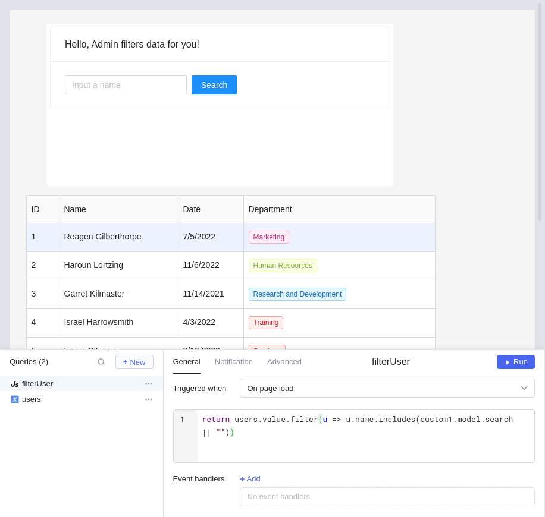

# Componente personalizado

No PocketBlocks, você pode projetar componentes personalizados usando a biblioteca React.js para satisfazer necessidades específicas ao construir seu aplicativo. O componente personalizado pode ser estático ou dinâmico, mas requer codificação.

## Pré-requisitos

- Bom entendimento de como construir um aplicativo em PocketBlocks.
- Familiarizado com HTML/CSS/JS e a biblioteca React.js.

## Fundamentos

Arraste um **componente personalizado** para a tela. Por padrão, PocketBlocks adiciona uma caixa de título, uma caixa de texto e dois botões, conforme mostrado abaixo. Você pode modificar **Dados** e **Código** no painel **Propriedades** para adaptá-los de acordo com suas necessidades.


Clique na borda em vez da área interna para selecionar um **Componente personalizado** e exibir suas configurações de propriedade.


<figure><figcaption></figcaption></figure>

### Dados

**Dados** armazena informações em pares de valores-chave, fornecendo uma interface para o **componente personalizado** interagir com dados externos. Por exemplo, você pode referenciar dados do **componente personalizado** em outros componentes do seu aplicativo por meio de `nomeDoComponenteCustomizado.model` ou passar dados de outros componentes para o **componente personalizado**.

<figure><figcaption></figcaption></figure>

### Código

Por padrão, PocketBlocks define o objeto `model` e duas funções `execultarConsulta` e `atualizarModel`.

<figure><figcaption></figcaption></figure>

- `executarConsulta` é uma função que aceita um nome de consulta em formato texto. Por exemplo, `executarConsulta(model.consulta)`.
- `atualizarModel` é uma função que aceita um único argumento do tipo objeto. O argumento passado para `atualizarModel` será mesclado com os dados do **Componente customizado**.

## Implementação

Todo o código do seu **componente personalizado**, incluindo HTML, CSS e JavaScript, é armazenado na caixa **Código** no painel **Propriedades**. Quando seu aplicativo for executado, o componente personalizado será incorporado em um elemento [iframe](https://developer.mozilla.org/en-US/docs/Web/HTML/Element/iframe). Para facilitar a interação entre o **Componente personalizado** e outros componentes do seu aplicativo, o PocketBlocks oferece uma API para você por meio de objetos globais. A definição do tipo e a descrição dos objetos são as seguintes.

```typescript
interface PBL {
  // Assine a alteração de dados
  //Quando os dados mudam, o manipulador será acionado
  // O valor retornado é a função de cancelamento de assinatura
  subscribe(handler: SubscribeHandler): () => void;
  // Função do componente React HOC que aceita um componente React
  // Retorna um novo componente que contém propriedades: runQuery, model, updateModel
  connect(Component: ComponentType<any>): ComponentType;
  // Execute a consulta especificada
  runQuery(queryName: string): Promise<void>;
  // Atualizar dados
  updateModel(patch: any): Promise<any>;
}

interface SubscribeHandler {
  (data: IDataPayload): void;
}

interface IDataPayload {
  model: any;
}
```

O exemplo a seguir é o mínimo de código que um componente personalizado requer para funcionar.

```javascript
<div id="react"></div>
<script type="text/babel">
    const MyCustomComponent = ({ runQuery, model, updateModel }) => (
        <p>Olá, mundo!</p>
    );
    const ConnectedComponent = pbl.connect(MyCustomComponent);
    ReactDOM.render(<ConnectedComponent />,
document.getElementById("react"));
</script>
```

## Interação de dados

### Passando dados do aplicativo para o componente personalizado

Por exemplo, para passar o texto em uma caixa de entrada para um componente personalizado, você pode usar a sintaxe `{{}}` para referenciar dados deste componente **Texto**. Observe que você também pode fazer referência a dados de consultas da mesma maneira.

<figure><figcaption></figcaption></figure>

Abaixo está o código para este exemplo.

```javascript
<div id="root"></div>

<script type="text/babel">

  const { Button, Card, Space } = antd;

  const MyCustomComponent = ({ runQuery, model, updateModel}) => (
    <Card title={"Olá, " + model.nome}>
        <p>{model.texto}</p>
        <Space>
          <Button
            type="primary"
            onClick={() => runQuery(model.query)}
         >
            Acionar consulta
          </Button>
          <Button
            onClick={() => updateModel({ texto: "Também estou de bom humor!" })}
          >
          Atualizar dados
          </Button>
      </Space>
    </Card>
  );

  const ConnectedComponent = pbl.connect(MyCustomComponent);

  const root = ReactDOM.createRoot(document.getElementById("root"));
  root.render(<ConnectedComponent />);

  </script>
```

### Passando dados do componente personalizado para o aplicativo

Por exemplo, para exibir determinado texto do **Componente personalizado** em um componente **Input** no aplicativo, você pode definir o valor de `custom1.model.nome` como o valor padrão de `entrada1`. A notação de ponto `custom1.model.nome` acessa o nome do **componente personalizado**.

<figure><figcaption></figcaption></figure>

### Acionando consulta do componente personalizado

Por exemplo, dada a tabela `usuarios` que exibe informações de todos os usuários, você deseja filtrar os dados com base no texto inserido em um **Componente personalizado**. Além disso, a operação de filtro é acionada clicando em um botão dentro do mesmo **Componente personalizado**.

<figure><figcaption></figcaption></figure>

De acordo com o requisito, o **componente personalizado** contém um componente **Input** e um componente **Botão**. Você também pode adicionar um componente **Texto** para fornecer contexto aos usuários do seu aplicativo. Quando um usuário insere na caixa de texto, por exemplo "Lor", e a seguir clica no botão de pesquisa, a tabela apresenta apenas as entradas em que o campo "Nome" que contém "Lor".

<figure><figcaption></figcaption></figure>

Para implementar esse **componente personalizado**, primeiro você cria a consulta `filtrarUsuario` para acessar os dados do componente personalizado e configura-o para ser executado por invocação manual.

```javascript
return usuarios.value.filter((u) =>
  u.name.includes(custom1.model.pesquisa || "")
);
```

Em seguida, você importa a biblioteca "antd" e utiliza os componentes **Button**, **Input**, **Card** e **Space**. Por fim, mais uma configuração para cada componente dentro do **Componente personalizado**:

- Configure o método `updateModel` para executar e atualizar os dados do **Componente personalizado** quando o texto no componente **Input** for alterado.
- Acionar a consulta `filtrarUsuario` pelo método `runQuery` quando o botão **Pesquisar** for clicado.

```javascript
<style type="text/css">
  body {
    padding: 5px;
  }
</style>

<link rel="stylesheet" type="text/css" href="https://unpkg.com/antd@4.21.4/dist/antd.min.css"/>

<script type="text/javascript" src="https://unpkg.com/antd@4.21.4/dist/antd.min.js" ></script>

  <div id="root"></div>

<script type="text/babel">

  const { Button, Card, Input, Space } = antd;

  const MyCustomComponent = ({ runQuery, model, updateModel}) => (
    <Card title={"Olá, " + model.nome + " filtra dados para você!"}>

        <Space>
      <Input
          value={model.search}
          onChange={e => updateModel({ pesquisa: e.target.value})}
          placeholder="Nome"
        />
          <Button
            type="primary"
            onClick={() => runQuery("filtrarUsuario")}
         >
            Search
          </Button>

      </Space>
    </Card>
  );

  const ConnectedComponent = pbl.connect(MyCustomComponent);

  const root = ReactDOM.createRoot(document.getElementById("root"));
  root.render(<ConnectedComponent />);

</script>
```
