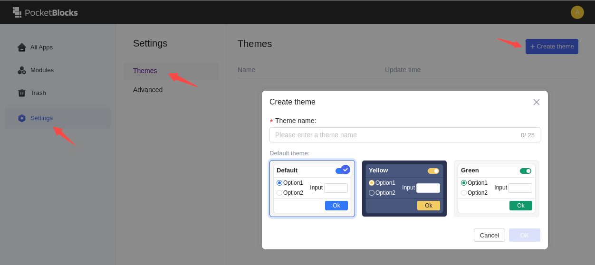
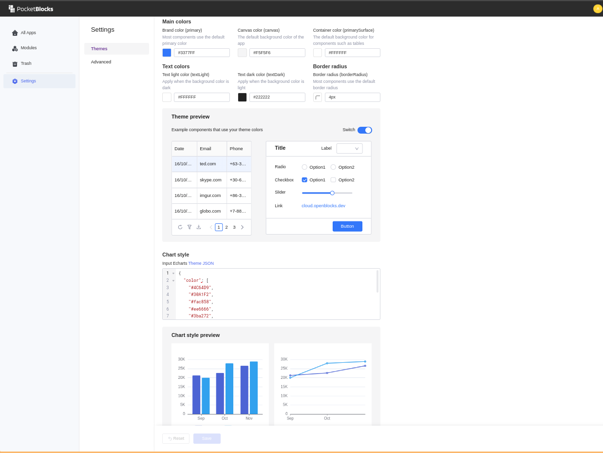

# Estilo, tema e usabilidade

Uma boa interface de usuário (UI) melhora a experiência do usuário (UX) e aumenta o envolvimento do usuário. Você pode personalizar o estilo de cada componente no PocketBlocks e usar o recurso de tema para projetar a interface por aplicativo ou espaço de trabalho. Recursos como configuração de ícones e mensagens de dicas tornam a interação do aplicativo mais fácil de usar.

## Estilos de componentes

Você pode modificar o estilo de todos os componentes na guia **Propriedades**.

<figure><figcaption></figcaption></figure>

Clique no seletor de cores para selecionar uma cor ou escreva o código de cores CSS na caixa de texto.

<figure><figcaption></figcaption></figure>

Você também pode escrever JavaScript na caixa de texto para controlar condicionalmente a configuração de estilo do componente.

<figure><figcaption></figcaption></figure>

## Temas

O recurso de tema ajuda você a definir rapidamente os estilos de todos os seus aplicativos em um espaço de trabalho, como a cor primária dos aplicativos e a cor de fundo padrão dos contêineres.

<figure><figcaption></figcaption></figure>

### Criando um tema

Os administradores do workspace têm acesso às configurações do tema. Na página inicial do PocketBlocks, vá para **Configurações** > **Temas** e clique em **+ Criar tema**. Insira o nome do tema e selecione um dos temas padrão predefinidos como ponto de partida.

<figure><figcaption></figcaption></figure>

Visualize o efeito do tema em tempo real à direita.

<figure><figcaption></figcaption></figure>

### Aplicando um tema

No editor do aplicativo, mude o tema clicando em ⚙️ na barra lateral esquerda. Selecione um tema em **Configuração de tema**.

<figure><figcaption></figcaption></figure>

Você também pode definir o tema padrão para todos os seus aplicativos em um espaço de trabalho em **Configurações** > **Temas** na página inicial do PocketBlocks.

<figure><figcaption></figcaption></figure>

### Alternando temas dinamicamente

Você pode acessar a variável global `theme` e chamar o método `theme.switchTo()` para permitir que os usuários finais mudem o tema dos aplicativos de seu lado usando JavaScript. A variável global `theme` possui três campos. Você pode visualizá-los no navegador de dados.

<figure><figcaption></figcaption></figure>

- `id` e `name` são strings, indicando o ID e o nome do tema atual. Quando seus valores estão vazios, o tema padrão é aplicado.
- `allThemes` é um array, incluindo todas as informações dos temas disponíveis no espaço de trabalho atual.

O método `theme.switchTo()` alterna o tema no lado do usuário final e requer apenas um ID do tema. Quando o valor passado é uma string vazia `""`, o tema padrão é aplicado. Assim que o usuário final mudar de tema, ele será salvo no armazenamento local do navegador do usuário. E esse tema substituirá o tema padrão e se aplicará a todos os aplicativos usados ​​no mesmo navegador.

#### Demonstração

Combinando listas de opções e eventos, os usuários finais podem mudar o tema dentro do aplicativo.

<figure><figcaption></figcaption></figure>

Siga as etapas abaixo para incluir esta função em seu aplicativo.

1. Arraste e solte um componente **Seletor** na tela. Defina o valor dos dados da seguinte maneira.

<pre class="idioma-Plain"><code class="lang-Plain"><strong>{{[{ id: "", nome: "Padrão" }, ...theme.allThemes]}}
</strong></code></pre>

2. Defina os rótulos e valores como `{{item.nome}}` e `{{item.id}}` respectivamente. Em seguida, você poderá visualizar o tema padrão e todos os outros temas disponíveis na área de trabalho atual.

<figure><figcaption></figcaption></figure>

3. Insira um componente **Botão** em sua tela para mudar de tema. Adicione um evento ao botão, selecione "Executar JavaScript" como a ação e execute o método `theme.switchTo()` que assume o valor do componente **Seletor**.&#x20;

<figure><figcaption></figcaption></figure>

## CSS customizado

PocketBlocks fornece um recurso CSS personalizado para um estilo de UI mais flexível e personalizado.

### CSS no nível do aplicativo

No editor de aplicativos, clique em ⚙️ na barra lateral esquerda, selecione **Scripts e estilo** > **CSS** e escreva o código CSS para o aplicativo atual.

<figure><figcaption></figcaption></figure>

Por exemplo, insira o componente de texto `texto1`. Em seguida, use `.texto1` como nome do elemento e modifique seu estilo CSS.

<figure><figcaption></figcaption></figure>


É recomendado modificar os estilos dos componentes em **Propriedades** > **Estilo** porque o DOM de um estilo CSS ajustado pode mudar conforme o sistema itera.


### Pré-carregando CSS

No PocketBlocks, os administradores do espaço de trabalho também podem definir estilos CSS pré-carregados para todos os aplicativos no espaço de trabalho. Abra **Configurações** e clique em **Avançado** > **Pré-carregar CSS**.

<figure><figcaption></figcaption></figure>

É altamente recomendado usar seletores CSS da seguinte forma:

| Nome da classe     | Descrição                    |
| ------------------ | ---------------------------- |
| cabeçalho superior | Barra de navegação superior  |
| contêiner raiz     | Contêiner raiz do aplicativo |

O nome de cada componente funciona como o nome da classe. Por exemplo, para o componente `texto1`, você pode usar `.texto1` como nome de classe e escrever código CSS para ele. E os nomes das classes compartilham o mesmo formato: `ui-comp-{TIPO_DO_COMPONENTE}` — por exemplo, você pode usar `.ui-comp-select` para definir o estilo CSS de todos os componentes seletores. Todos os nomes de classes dos componentes estão listados a seguir.

```Plain
input
textArea
password
richTextEditor
numberInput
slider
rangeSlider
rating
switch
select
multiSelect
cascader
checkbox
radio
segmentedControl
file
date
dateRange
time
timeRange
button
link
dropdown
toggleButton
text
table
image
progress
progressCircle
fileViewer
divider
qrCode
form
jsonSchemaForm
container
tabbedContainer
modal
listView
navigation
iframe
custom
module
jsonExplorer
jsonEditor
tree
treeSelect
audio
video
drawer
carousel
collapsibleContainer
chart
imageEditor
scanner
```

Evite usar nomes de classes que possam mudar com iterações, como `sc-dkiQaF bfTYCO`.PocketBlocks suporta [pré-processador CSS](https://stylis.js.org/), você pode usar o aninhamento CSS para melhorar a eficiência, por exemplo:

```css
.texto1 {
  span {
    color: red;
    font-weight: bold;
  }
}
```

Todo o CSS personalizado para aplicativos é salvo no espaço chamado `#app-{ID_DO_APP}`, e o CSS dos módulos é salvo no espaço chamado `#module-{ID_DO_MODULO}`.Se o seu CSS pré-carregado não funcionar corretamente, pode ser substituído pelo tema ou estilos de componente com maior prioridade. Abra o navegador **Inspecionar** para verificar.

### Demo 1: Quebra de linha no cabeçalho da tabela

Para permitir quebra de linha no cabeçalho da tabela, insira o seguinte código em **Script e estilo** > **CSS**.

```css
.tabela1 {
  th div {
    white-space: pre-wrap;
    word-break: break-word;
    max-height: unset;
  }
}
```

<figure><figcaption></figcaption></figure>

### Demo 2: Família de fontes personalizadas

Para usar uma família de fontes personalizada, você precisa primeiro defini-la e depois aplicá-la. Insira o seguinte código em **Script e estilo** > **CSS** para aplicar a fonte "Fredoka One" a todos os componentes de texto usando o modo Markdown no aplicativo.

```css
@font-face {
  font-family: "Fredoka One";
  font-style: normal;
  font-weight: 400;
  src: url(https://fonts.gstatic.com/s/fredokaone/v13/k3kUo8kEI-tA1RRcTZGmTlHGCaen8wf-.woff2)
    format("woff2");
}

.ui-comp-text .markdown-body {
  font-family: "Fredoka One";
  font-size: 30px;
}
```

<figure><figcaption></figcaption></figure>

## Interação amigável

PocketBlocks sempre faz jus à eficiência, segurança e design fácil de usar.

### Ocultar componentes da UI

Defina as propriedades ocultas dos componentes quando necessário para evitar sobrecarga de informações. Por exemplo, ao criar um formulário de coleta de sugestões, você pode definir a caixa de entrada como visível ou oculta dependendo da seleção do usuário. 

Para conseguir este efeito, defina a propriedade oculta do componente `areaDeTexto1` com o código:

```JavaScript
{{Number(radio1.value) === 1 ? 'false' : 'true'}}
```

Quando o valor do componente `radio1` é “1”, o valor da propriedade oculta é “false”; caso contrário, o valor será "verdadeiro". O layout do componente é ajustado automaticamente.

<figure><figcaption></figcaption></figure>

### Configuração de ícones

Os ícones são intuitivos e podem ser alternativas ao texto em alguns casos. O uso adequado dos ícones proporciona aos usuários uma melhor experiência visual e os ajuda a usar o aplicativo com mais facilidade.

Ícones de prefixo e sufixo estão disponíveis para alguns componentes, como **Botão**. Adicione ícones em **Propriedades** > **Layout**.

<figure><figcaption></figcaption></figure>

Você pode selecionar ícones predefinidos ou escrever código JS para inserir ícones, por exemplo, `{{ "/icon:solid/Users" }}`.

### Espaço reservado e dica de ferramenta

As dicas melhoram a usabilidade do aplicativo – por exemplo, mostrar dicas para a entrada ajuda os usuários a interagir melhor com o aplicativo.

- Espaço reservado: é exibido no campo de entrada vazio para solicitar ao usuário o que digitar.
- Dica: Adiciona um sublinhado ao rótulo. Os usuários podem ver a dica de ferramenta passando o mouse.

<figure><figcaption></figcaption></figure>

### Notificações

Notificações são mensagens enviadas diretamente aos seus usuários para lembrá-los do status de suas operações, confirmar o sucesso ou ajudá-los a prosseguir.

#### Notificações globais

Notificações globais para determinadas interações do usuário fornecem feedback oportuno aos usuários. PocketBlocks oferece quatro tipos de notificações globais: **Informações**, **Sucesso**, **Aviso** e **Erro**.

Você pode definir notificações globais de três maneiras:

1. Definindo em **Manipuladores de eventos** > **Ação** > **Mostrar notificação**. Consulte [Mostrar notificação](../event-handlers.md#show-notification) (Manipuladores de eventos).
2. Definindo **consultas JavaScript** com [funções integradas](../write-javascript/built-in-javascript-functions.md).
3. Definindo na aba **Notificação** nas configurações de consulta. Consulte [Guia Notificação](../../queries/query-basics.md#notification-tab-and-advanced-tab).

### Efeito de carregamento

Quando uma consulta demora para ser executada, você pode definir o efeito de carregamento para informar aos usuários que a consulta está em execução e evitar que executem operações frequentes.

Por exemplo, o efeito de carregamento do botão Enviar é `{{form1SubmitToHrmsEn1.isFetching}}`. Clicar no botão aciona a execução da consulta `form1SubmitToHrmsEn1` e, durante esse processo, o botão é exibido com o efeito de carregamento.

<figure><figcaption></figcaption></figure>

#### Modal de confirmação

Você pode definir uma modal de confirmação para uma verificação dupla para seus usuários quando eles realizam operações como adicionar, modificar ou excluir dados. Na guia **Avançado** da consulta, alterne **Mostrar um modal de confirmação antes de executar** e insira uma mensagem de confirmação.

<figure><figcaption></figcaption></figure>

#### Design de formulário

Formulários são frequentemente usados ​​para coletar informações. Para obter mais detalhes sobre como criar formulários produtivos e fáceis de seguir, consulte [Criar um formulário eficiente e fácil de usar](design-an-efficient-and-user-friendly-form.md).
