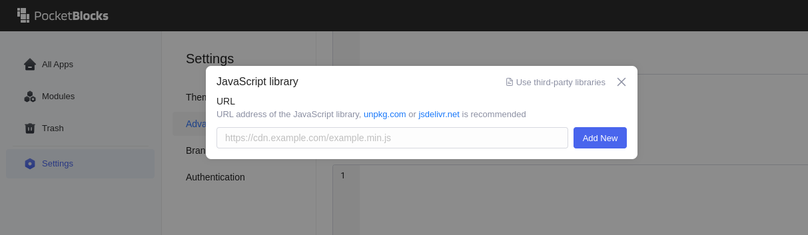

# Usando bibliotecas de terceiros

Todo desenvolvedor aprende um dos princípios mais importantes da engenharia de software no início de sua carreira: DRY (Don’t Repeat Yourself). O uso de bibliotecas de terceiros pode economizar seu tempo, pois você não precisa desenvolver a funcionalidade que a biblioteca oferece. PocketBlocks fornece algumas bibliotecas integradas de terceiros para usos comuns, e você pode importar manualmente outras bibliotecas sob demanda.

## Bibliotecas integradas

PocketBlocks fornece algumas bibliotecas JavaScript integradas para uso.

| Biblioteca               | Documentação                                                                                                         | Versão                       |
| ------------------------ | -------------------------------------------------------------------------------------------------------------------- | ---------------------------- |
| lodash                   | [https://lodash.com/docs/](https://lodash.com/docs/)                                                                 | 4.17.21                      |
| moment                   | [https://momentjs.com/docs/](https://momentjs.com/docs/)                                                             | 2.29.3                       |
| uuid                     | [https://github.com/uuidjs/uuid](https://github.com/uuidjs/uuid)                                                     | 8.3.2（Support v1/v3/v4/v5） |
| numbro                   | [https://numbrojs.com/format.html](https://numbrojs.com/format.html)                                                 | 2.3.6                        |
| papaparse(Papa)          | [https://www.papaparse.com/docs](https://www.papaparse.com/docs)                                                     | 5.3.2                        |
| PocketBase SDK(pb)       | [https://pocketbase.io/docs/client-side-sdks](https://pocketbase.io/docs/client-side-sdks)                           | 0.21.3                       |
| TanStack QueryClient(qc) | [https://tanstack.com/query/v5/docs/reference/QueryClient](https://tanstack.com/query/v5/docs/reference/QueryClient) | 5.44.0                       |

## Importando manualmente bibliotecas de terceiros

PocketBlocks suporta a configuração de JavaScript pré-carregado e bibliotecas que podem estar no **nível do aplicativo** ou no **nível do espaço de trabalho**.

- **Bibliotecas em nível de aplicativo** são carregadas somente no aplicativo onde definido. Além disso, o aplicativo A não pode usar bibliotecas configuradas para o aplicativo B.
- **Bibliotecas no nível do espaço de trabalho** serão carregadas quando você abrir qualquer aplicativo no seu espaço de trabalho. Todos os aplicativos podem acessar essas bibliotecas. Pode haver um certo impacto no desempenho do aplicativo, especialmente quando você tem funções JavaScript complexas que não estão sendo usadas em todos os aplicativos.


**Dicas que você deve saber antes de configurar bibliotecas:**

- Bibliotecas externas são carregadas e executadas no navegador.
- Bibliotecas somente NodeJS não são suportadas.
- URLs de bibliotecas externas precisam oferecer suporte a vários domínios.
- A exportação da biblioteca deve ser configurada diretamente no objeto window, variáveis ​​globais como `var xxx = xxx` não têm efeito.
- As bibliotecas externas são executadas em um ambiente sandbox restrito e as seguintes variáveis ​​globais não estão disponíveis:

  <mark style="background-color:yellow;">`parent`</mark>

  <mark style="background-color:yellow;">`document`</mark>

  <mark style="background-color:yellow;">`location`</mark>

  <mark style="background-color:yellow;">`chrome`</mark>

  <mark style="background-color:yellow;">`setTimeout`</mark>

  <mark style="background-color:yellow;">`fetch`</mark>

  <mark style="background-color:yellow;">`setInterval`</mark>

  <mark style="background-color:yellow;">`clearInterval`</mark>

  <mark style="background-color:yellow;">`setImmediate`</mark>

  <mark style="background-color:yellow;">`XMLHttpRequest`</mark>

  <mark style="background-color:yellow;">`importScripts`</mark>

  <mark style="background-color:yellow;">`Navigator`</mark>

  <mark style="background-color:yellow;">`MutationObserver`</mark>

  

Agora vamos pegar **cowsay** como exemplo e importá-lo no nível do aplicativo e no nível do espaço de trabalho.

- Página do GitHub: [https://github.com/piuccio/cowsay](https://github.com/piuccio/cowsay)
- Link da Biblioteca: [https://unpkg.com/cowsay@1.5.0/build/cowsay.umd.js](https://unpkg.com/cowsay@1.5.0/build/cowsay.umd.js)

### No nível do aplicativo

Navegue até a página de configurações e clique no sinal de mais **+** na guia **Biblioteca JavaScript**. Cole o link **cowsay** e clique em **Adicionar novo**.

<figure><figcaption></figcaption></figure>

Crie uma consulta JS e insira o código.

<figure><figcaption></figcaption></figure>

Você pode obter o mesmo resultado chamando o método `cowsay.say()` no valor do componente de texto.

<figure><figcaption></figcaption></figure>

Observe que a biblioteca cowsay é importada no nível do aplicativo e você não pode usá-la em nenhum outro aplicativo em seu espaço de trabalho.

### No nível do espaço de trabalho

Vá para a página inicial do PocketBlocks, selecione **Configurações** > **Avançado** e clique em **Adicionar** na guia **Biblioteca JavaScript**. Cole o link da biblioteca JS de terceiros e clique em **Adicionar novo** para adicioná-la ao seu espaço de trabalho. As bibliotecas instaladas podem ser acessadas de qualquer aplicativo em seu espaço de trabalho.

<figure><figcaption></figcaption></figure>
