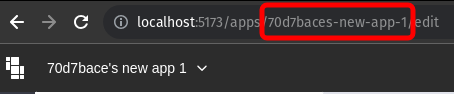

# Funções JS integradas

## utils - funções utilitárias

### utils.openUrl()

Abra um URL.

```javascript
// Sintaxe
utils.openUrl( url: string, options?: { newTab:  boolean = true } )
```

| Parâmetros     | Descrição                                                                                                                        |
| -------------- | -------------------------------------------------------------------------------------------------------------------------------- |
| <p>url<br></p> | Obrigatório. Um valor **Texto** que especifica o URL a ser aberto. Deve começar com _http://_ or _https://_.                     |
| newTab         | Opcional. **Booleano** valor que, quando **True**, especifica que o URL será aberto em uma nova guia. O valor padrão é **True**. |

```javascript
// Exemplo: Abre google.com em uma nova aba.
utils.openUrl("https://www.google.com", { newTab: true });
```

### utils.openApp()

Abra um aplicativo PocketBlocks.

```javascript
// Sintaxe
utils.openApp( applicationId: string, options?: { queryParams?: {"chave":"valor"}, hashParams?: {"chave":"valor"}, newTab: true } )
```

| Parâmetro                                                      | Descrição                                                                                                                                                                                                                                |
| -------------------------------------------------------------- | ---------------------------------------------------------------------------------------------------------------------------------------------------------------------------------------------------------------------------------------- |
| <p>appId<br></p>                                               | <p>Obrigatório. Um valor <strong>Texto</strong> que especifica o ID do aplicativo a ser aberto.</p><p> </p> |
| queryParams: {'chave1':'valor1',chave2:'valor2',...}           | Opcional. Um **Objeto** que especifica parâmetros de consulta a serem transmitidos ao aplicativo. Os parâmetros de consulta são adicionados ao URL do aplicativo na forma de ?_chave1=valor1\&chave2=valor2&..._                         |
| <p>hashParams：{'chave1':'valor1',chave2:'valor2',...}<br></p> | Opcional. Um **Object** que especifica parâmetros de hash a serem transmitidos ao aplicativo. Os parâmetros hash são adicionados ao URL do aplicativo na forma de _#chave1=valor1\&chave2=valor2&..._                                    |
| newTab                                                         | Opcional. Um valor **Booleano** que, quando **True**, especifica o URL deve ser aberto em uma nova guia. O valor padrão é **True**.                                                                                                      |

```javascript
// Exemplo: Abre um aplicativo PocketBlocks em uma nova guia.
utils.openApp("632bddc33bb9722fb888f6c0", { newTab: true });

// Exemplo: Abre um aplicativo PocketBlocks e passa o parâmetro "id".
utils.openApp("632bddc33bb9722fb888f6c0", {
  queryParams: { id: tabela1.selectedRow.id },
});
```

### utils.downloadFile()

Baixa um arquivo contendo os dados especificados.

```javascript
// Sintaxe
utils.downloadFile(data: any, fileName: string, options?: {
  fileType?: string,
  dataType?: "url" | "base64"
} )
```

| Parâmetro | Descrição                                                                                                                                                                                                    |
| --------- | ------------------------------------------------------------------------------------------------------------------------------------------------------------------------------------------------------------ |
| data      | Obrigatório. Um **Texto** ou **Objeto** que especifica os dados para download de consultas, componentes, transformadores, etc.                                                                               |
| fileName  | Obrigatório. Um valor **Texto** que especifica o nome do arquivo para download.                                                                                                                              |
| fileType  | Opcional. Um valor **Texto** que especifica o tipo de arquivo para download. Todos os [tipos MIME](https://developer.mozilla.org/en-US/docs/Web/HTTP/Basics_of_HTTP/MIME_types/Common_types) são suportados. |
| dataType  | Opcional. Um valor **Texto** que especifica o tipo de dados: "url" ou "base64".                                                                                                                              |

```javascript
// Exemplo: baixe os dados base64 de um componente de arquivo como um arquivo PNG denominado dados-do-usuario.
utils.downloadFile(file1.value[0], "dados-do-usuario", {
  fileType: "png",
  dataType: "base64",
});

// Exemplo: Faça download dos resultados de consulta1 como um arquivo XLXS denominado dados-do-usuario.
utils.downloadFile(consulta1.data, "dados-do-usuario", { fileType: "xlsx" });
// ou desta forma:
utils.downloadFile(consulta1.data, "dados-do-usuario.xlsx");

// Exemplo: Faça download dos resultados de consulta1 como um arquivo PDF denominado dados-do-usuario.
utils.downloadFile(consulta1.data, "dados-do-usuario", {
  fileType: "pdf",
  dataType: "base64",
});
```

### utils.copyToClipboard()

Copie um texto para a área de transferência.

```javascript
// Sintaxe
utils.copyToClipboard( text: string )
```

| Parâmetro | Descrição                                                                |
| --------- | ------------------------------------------------------------------------ |
| text      | Obrigatório. Um valor **Texto** que especifica o conteúdo a ser copiado. |

```javascript
// Exemplo: Copie o conteúdo do componente de entrada para a área de transferência.
utils.copyToClipboard(input1.value);
```

## message – notificação global

Use métodos `message` para enviar uma notificação de alerta global, que é exibida na parte superior da tela e dura 3 segundos por padrão. Cada um dos quatro métodos a seguir oferece suporte a um estilo de exibição exclusivo.

```javascript
// message.info( text: string, options?: {duration: number = 3 } )
message.info("Por favor confirme suas informações", { duration: 10 });
// message.success( text: string, options?: {duration: number = 3 } )
message.success("A consulta foi executada com sucesso", { duration: 10 });
// message.warn( text: string, options?: {duration: number = 3 } )
message.warn("Aviso", { duration: 10 });
// message.error( text: string, options?: {duration: number = 3 } )
message.error("Consulta foi executada com erro", { duration: 10 });
```

<figure><figcaption></figcaption></figure>

## localStorage

Use métodos `localStorage` para armazenar e gerenciar dados de pares de valores-chave localmente, que não são redefinidos quando o aplicativo é atualizado e podem ser acessados ​​em qualquer aplicativo dentro do espaço de trabalho usando `localStorage.values`.

| Método                             | Descrição                             |
| ---------------------------------- | ------------------------------------- |
| setItem(_key: string, value: any_) | Armazena um par de chave valor.       |
| removeItem(_key: string_)          | Remove um par de chave valor.         |
| clear()                            | Limpa todos os dados no localStorage. |

### localStorage.values

Você pode acessar qualquer par de chave valor no armazenamento local usando `localStorage.valores.` em consultas JavaScript.

<figure><figcaption></figcaption></figure>

Inspecione os dados em localStorage em **Globals** no navegador de dados.

<figure><figcaption></figcaption></figure>

### localStorage.setItem()

Armazena um par de chave valor.

```javascript
// Sintaxe
localStorage.setItem(key: string, value: any)

// Exemplo
localStorage.setItem("pedido", seletor1.value)
```

### localStorage.removeItem()

Remove um par de chave valor.

```javascript
// Sintaxe
localStorage.removeItem(key: string)

// Exemplo
localStorage.removeItem("pedido")
```

### localStorage.clear()

Limpa todos os dados no localStorage.
