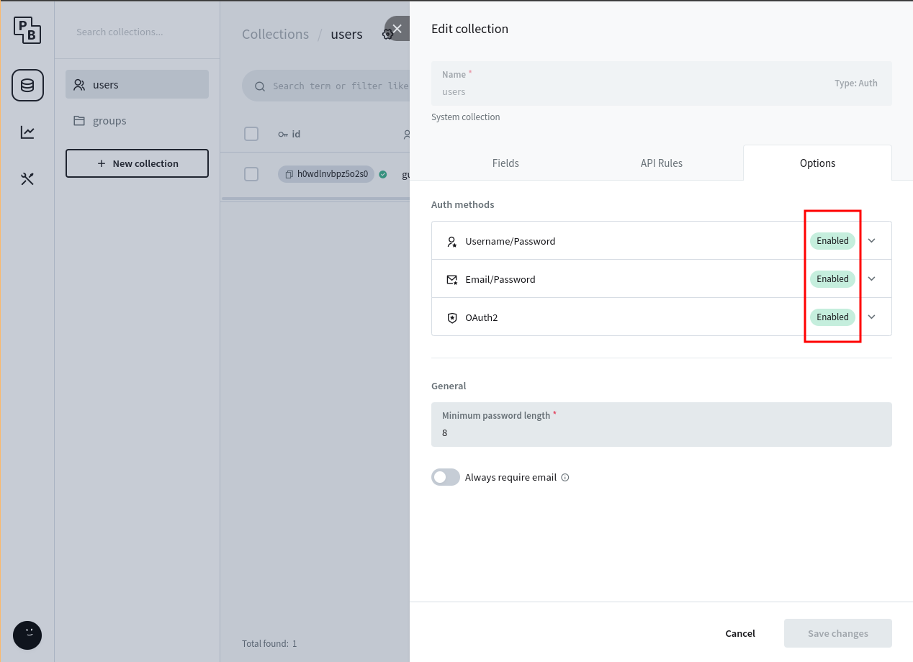
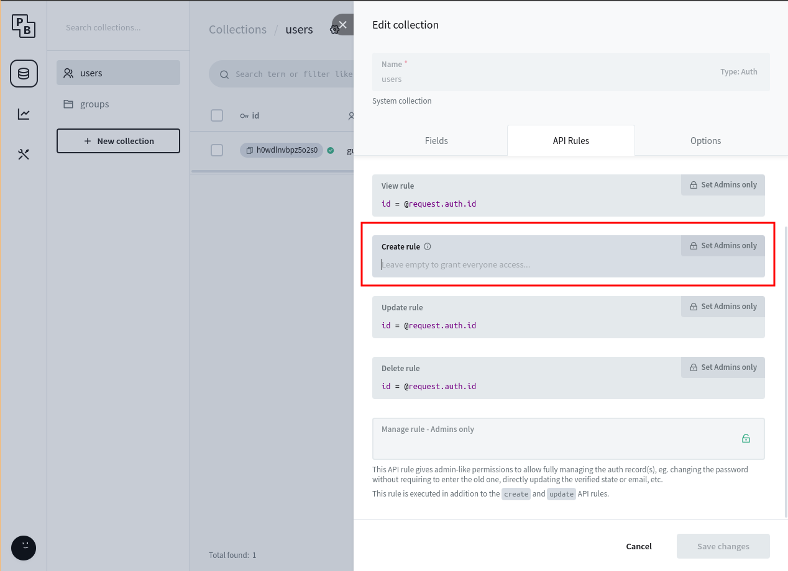
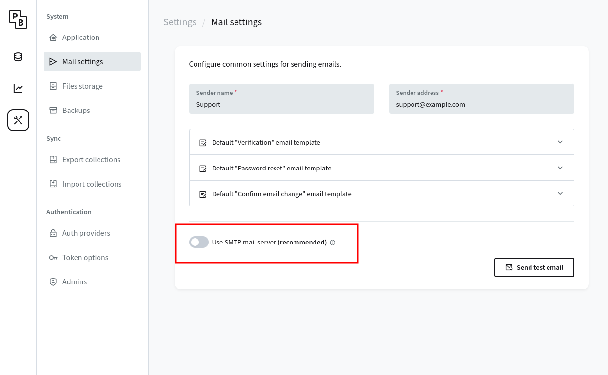

# Autenticação

PocketBlocks oferece uma lista enorme de opções de autenticação. Se você pode usá-lo no [Pocketbase](https://pocketbase.io/), você pode usá-lo no PocketBlocks.

## Habilitando opções de autenticação

Por padrão, a autenticação com nome de usuário e e-mail está habilitada.

<figure><figcaption></figcaption></figure>

Para permitir que os usuários se autentiquem com **provedores OAuth**, acesse o painel de administração do Pocketbase, **Settings** no menu lateral, selecione **Auth providers** e configure algumas das opções disponíveis.

<figure><figcaption></figcaption></figure>

## Cadastro

Por padrão, qualquer pessoa pode se cadastrar. Para desabilitar a página de cadastro (e recurso), crie uma regra com restrições.

<figure><figcaption></figcaption></figure>

## Customização

Você pode personalizar alguns aspectos da página de autenticação. Vá para a página **Configurações do PocketBlocks** e vá para **Autenticação**:

<figure><figcaption></figcaption></figure>

Você pode alterar o rótulo de entrada do nome de usuário e aplicar uma máscara selecionando a opção de tipo de login **Local**:

<figure><figcaption></figcaption></figure>

Você também pode alterar o nome de um provedor OAuth e seu ícone selecionando a respectiva opção de tipo de login:

<figure><figcaption></figcaption></figure>

## Funcionalidades de email

Para ativar a recuperação de senha e verificação/alteração de e-mail, você precisa configurar um **Servidor SMTP** no Painel de Administração do PocketBase:

<figure><figcaption></figcaption></figure>
