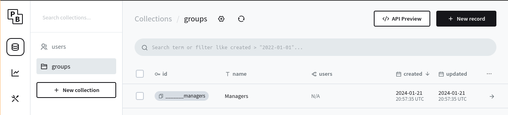

# Membros e grupos

No PocketBlocks, você pode organizar os membros do seu espaço de trabalho usando diferentes grupos e atribuir funções aos grupos para gerenciar [permissões para recursos](permissions-for-resources.md). Você pode encontrar configurações de membros e grupos em **users** e **groups** no painel de administração do Pocketbase.

<figure><figcaption></figcaption></figure>

## Gerenciando membros do espaço de trabalho

### Funções e permissões do espaço de trabalho

Os usuários podem ser **Administradores** ou **Membros**. Para ser um **Administradores** o usuário precisa ser um **Pocketbase Admin**, caso contrário, será um **membro**.

| Função        | Permissões em nível de espaço de trabalho e grupo                                                                                                                                                                                                                                                           |
| ------------- | ----------------------------------------------------------------------------------------------------------------------------------------------------------------------------------------------------------------------------------------------------------------------------------------------------------- |
| Administrador | 
Espaço de trabalho
<ul><li>Modificar informações do espaço de trabalho (nome, logotipo etc.)</li><li>Gerenciar membros do espaço de trabalho</li><li>Ver membros do espaço de trabalho</li></ul>
Grupos
<ul><li>Criar grupos</li><li>Excluir grupos</li><li>Gerenciar membros do grupo</li></ul> |
| Membro        | Nenhuma                                                                                                                                                                                                                                                                                                     |

## Gerenciando grupos

O gerenciamento baseado em grupo ajuda a organizar membros de diferentes departamentos funcionais em seu espaço de trabalho. Você pode criar grupos na coleção **groups** do Pocketbase.

<figure><figcaption></figcaption></figure>

### Funções e permissões de grupo

As permissões estão listadas na tabela abaixo.

| Função        | Permissões                                                                                                                                                                                             |
| ------------- | ------------------------------------------------------------------------------------------------------------------------------------------------------------------------------------------------------ |
| Administrador | <ul><li>Alterar nome do grupo</li><li>Excluir grupos</li><li>Gerenciar membros do grupo</li><li>Ver membros do grupo</li><li>Gerenciar aplicativos de grupo</li><li>Ver aplicativos de grupo</li></ul> |
| Membro        | Ver aplicativos do grupo                                                                                                                                                                               |
