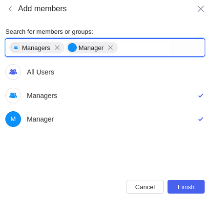

# Permissões para recursos

As permissões determinam as ações que os usuários podem realizar nos recursos, incluindo aplicativos, módulos, navegações, pastas.&#x20;

Somente administradores do workspace têm permissão para criar recursos.

## Aplicativos, módulos, **navegações**

As permissões para esses três recursos são as mesmas.

<figure><figcaption></figcaption></figure>

### Compartilhe e defina funções

**Administradores** podem adicionar membros e atribuir uma **função de visualizador** a eles. Ao editar um aplicativo web, um módulo ou uma navegação, clique em **Compartilhar** no canto superior direito e, em seguida, clique em **Adicionar membros**.

<figure><figcaption></figcaption></figure>

Escolha membros e grupos da lista.

### Tornar público

Se quiser tornar um aplicativo, módulo ou navegação pública para todos os usuários (incluindo usuários anônimos), você pode ativar **Tornar o aplicativo público** nas configurações de **Compartilhar**.

## Pasta

As pastas ajudam você a organizar os aplicativos, módulos e navegações no espaço de trabalho. Somente **administradores** do espaço de trabalho têm as seguintes permissões para pastas:

- Criar
- Renomear
- Excluir
- Mover os aplicativos, módulos e navegações para dentro ou fora das pastas
