# Authentication

PocketBlocks provides a huge list of authentication options. If you can use it in [Pocketbase](https://pocketbase.io/), you can use it in PocketBlocks.

## Enable Authentication Options

To enable authentication in your PocketBlocks Workspace, go to the Pocketbase Admin Panel and look for the **pbl_auth** collection and click in **New record**.

<figure>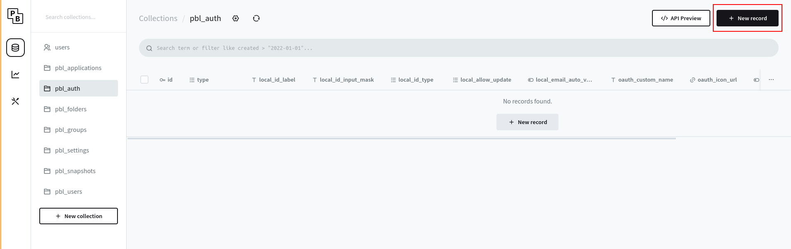<figcaption></figcaption></figure>

Choose the **type** of authentication:

<figure>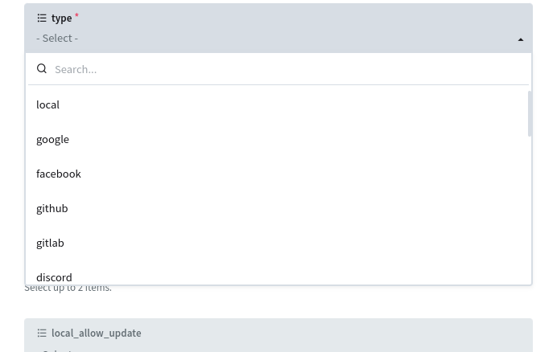<figcaption></figcaption></figure>

### Local Authentication


Use **local** type if you want to authenticate users with email or username.


The **local_id_label** field is used to change the label of the username/email field on the login page.

<figure>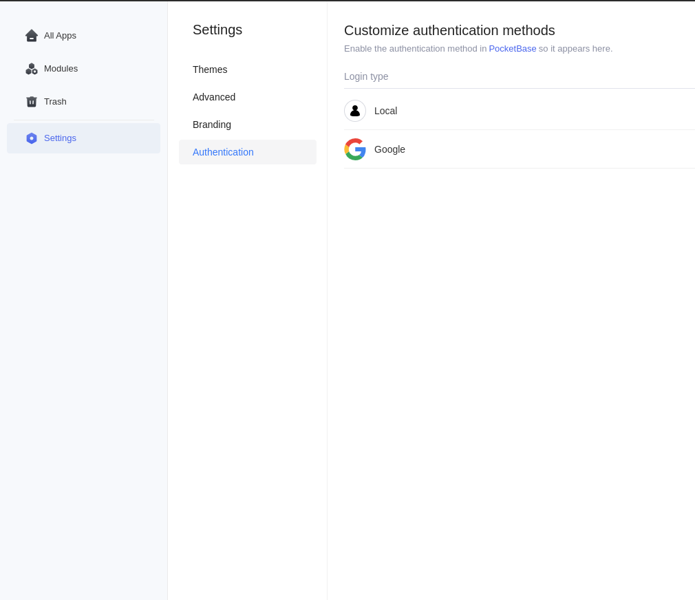<figcaption></figcaption></figure>

<figure>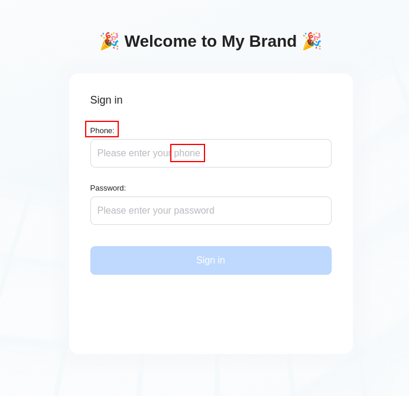<figcaption></figcaption></figure>

If you need to apply some mask in username/email on the login page, just set the mask in **local_id_input_mask** field according to [use-mask-input](https://github.com/eduardoborges/use-mask-input).

<figure>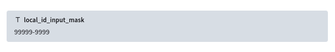<figcaption></figcaption></figure>

<figure>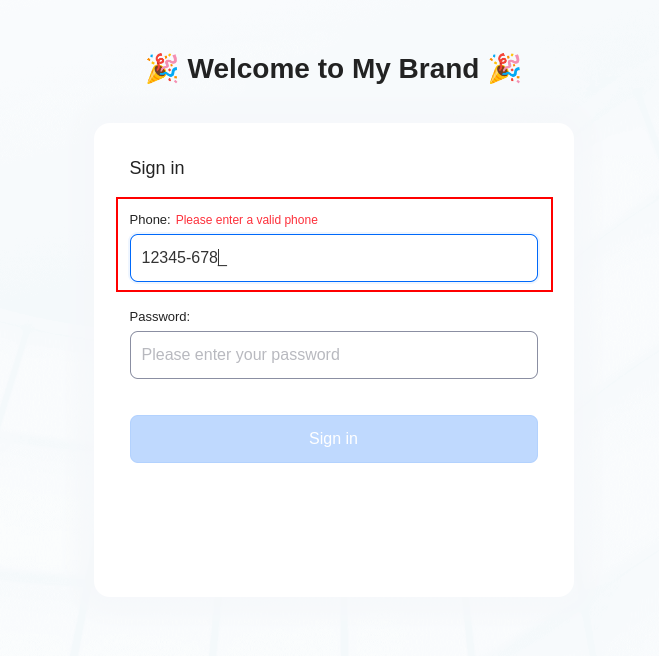<figcaption></figcaption></figure>

You can set if the user can login with a **username** or **email** by selecting them in **local_id_type**.

<figure>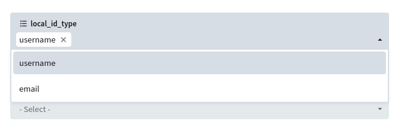<figcaption></figcaption></figure>


If you do not select **email**, the user will not be able to recover his/her password.


With the **local_allow_update** you can configure what the user can change(email/username/password).

<figure>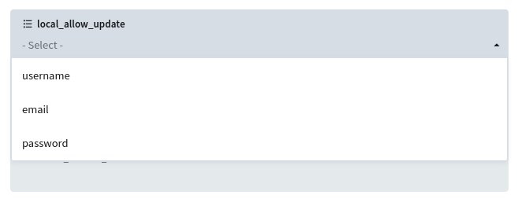<figcaption></figcaption></figure>


If you do not select the **password** option, the user will not be able to change his/her password nether recover it.


If you don't need/want to send emails to verify users, you can set the **local_email_auto_verified** field to mark the new user's email as **verified**.

<figure><figcaption></figcaption></figure>


This option is only allowed if **email** is selected in **local_id_type** field.


### Oauth Authentication

Set the **oauth_custom_name** if you need to change the name of the provider on the login page.

<figure>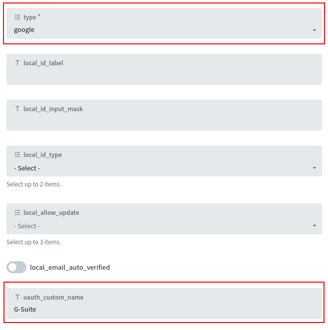<figcaption></figcaption></figure>

<figure>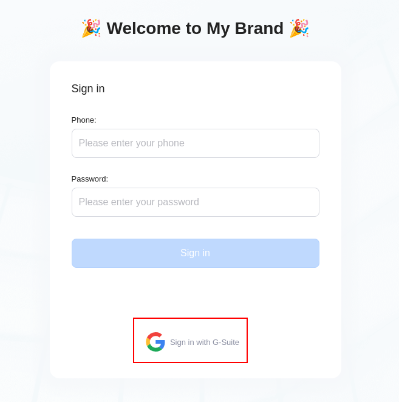<figcaption></figcaption></figure>

Set the **oauth_icon_url** if you need to change the icon displayed on the login page.

<figure>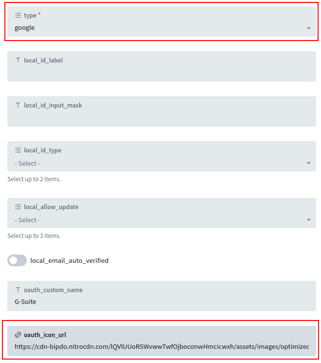<figcaption></figcaption></figure>

<figure>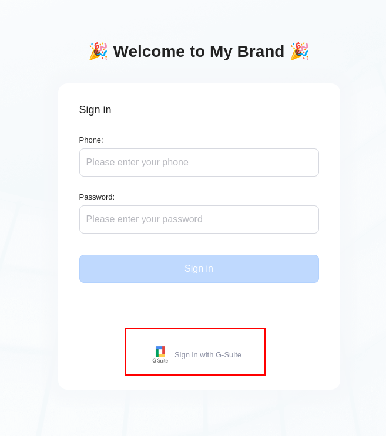<figcaption></figcaption></figure>


Remember to enable the provider in PocketBase Settings.


<figure><figcaption></figcaption></figure>

### Signup

To allow the user to register him/herself with the current provider(oauth/local), set the **allow_signup** field to true.

<figure><figcaption></figcaption></figure>

<figure>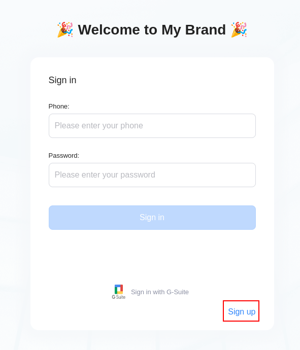<figcaption></figcaption></figure>

<figure>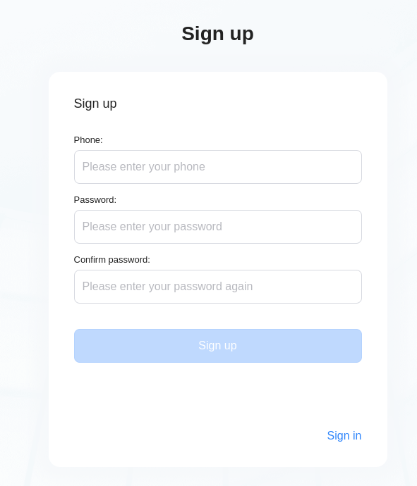<figcaption></figcaption></figure>


If **allow_signup** is set to false, the signup page will be disabled.

