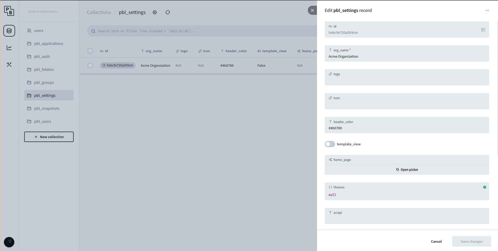
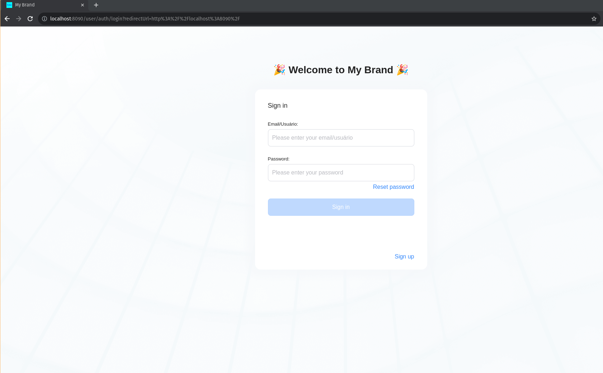
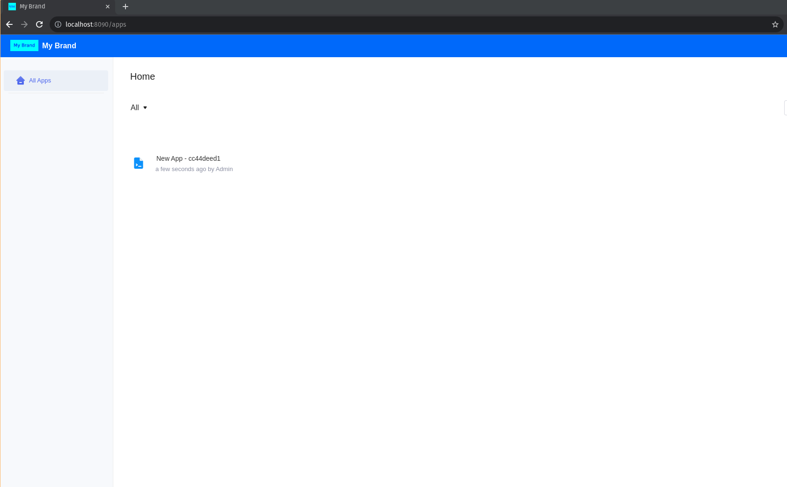
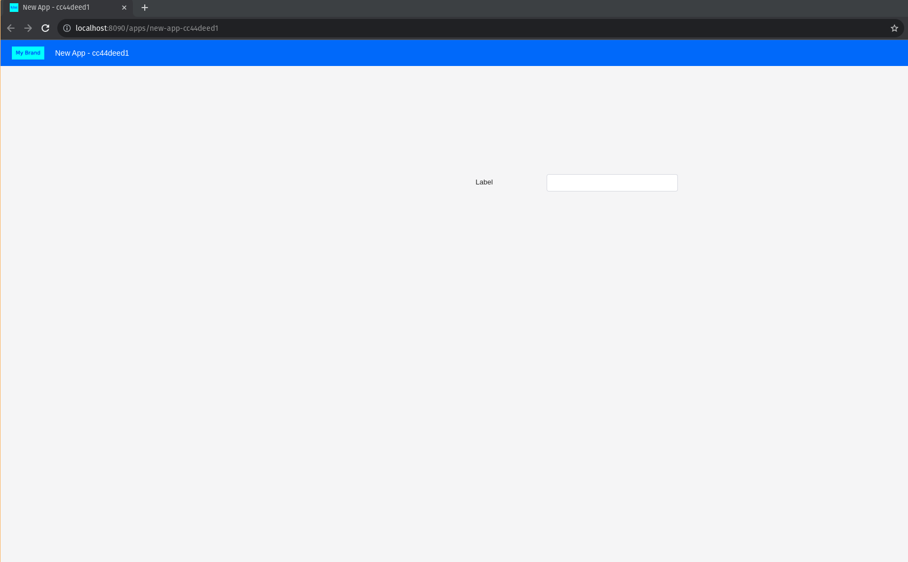
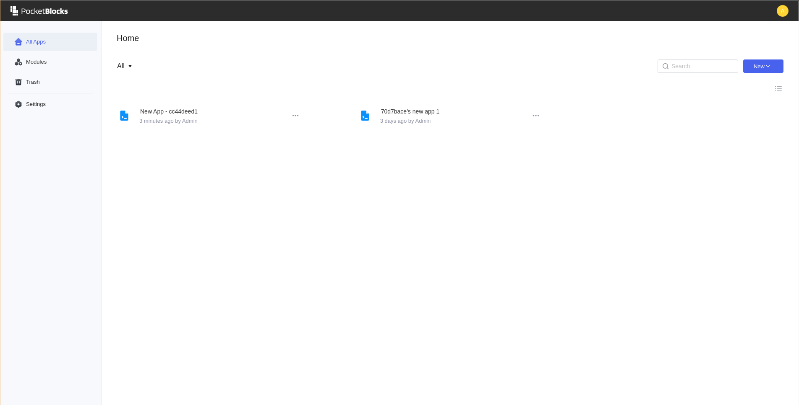

# Custom branding

PocketBlocks provides a white-labelling feature that allows you to customize your workspace's **branding**, including logo, favicon, brand name and color. You can easily configure branding to match your company's branding and benefit from consistent experiences with your company's existing internal tools.

## Branding settings

Only **Admins** have the permission to customize branding. Navigate to **Pocketbase Admin Panel**, go to **pbl_settings** collection and select the generated workspace settings.

<figure><figcaption></figcaption></figure>

The customizable branding settings are listed as follows:

- Logo: Set the **logo** field with the logo's URL. PocketBlocks supports `.jpg`, `.svg`, and `.png` files.
- Head color: Set a hexcolor(#000000) value to **header_color** field.
- Brand name: Enter your **Brand Name** in the **org_name** field.
- Favicon: Set the **icon** field with the icon's URL. Use `.ico` or `.png` files.


Click the **Save changes** button and the settings will immediately take effect.


### Example&#x20;

The following pictures show what workspace **members** and **end users** will see on the login page, homepage, and application pages after branding is successfully customized (take the brand name "My brand" for example).

<figure><figcaption>
the login page
</figcaption></figure>

<figure><figcaption>
the homepage
</figcaption></figure>

<figure><figcaption>
application pages
</figcaption></figure>

Note that workspace **admins** still see "PocketBlocks" branding on the homepage and application pages.

<figure><figcaption></figcaption></figure>
