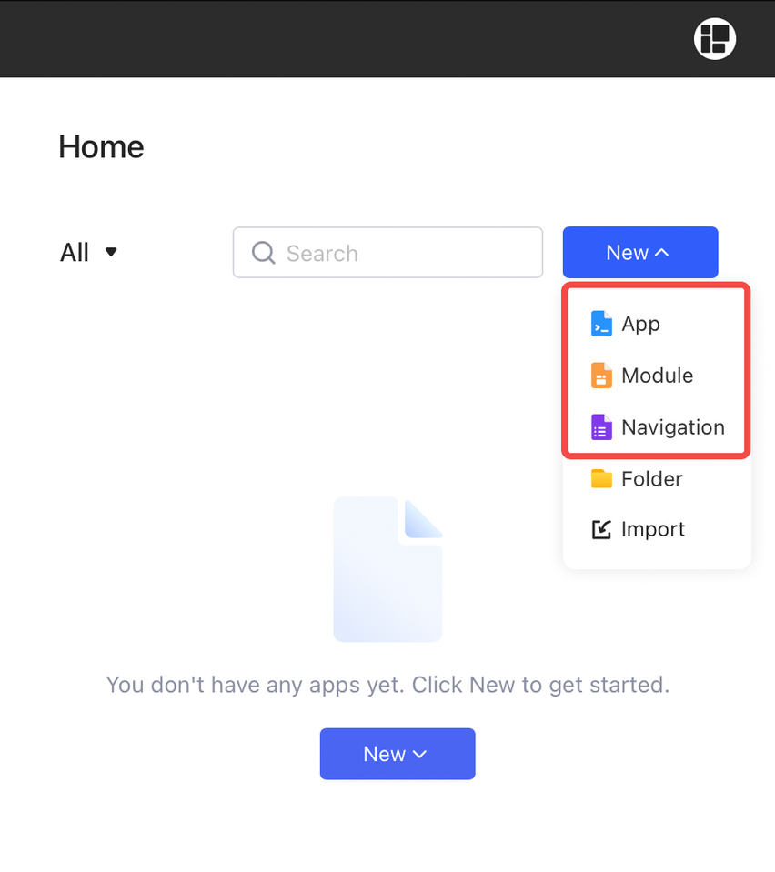

# Permissions for resources

Permissions determine the actions users can take on resources, including apps, modules, navigations, folders.&#x20;

Only workspace admins are allowed to create resources.

## Apps, modules, **navigations**

The permissions for these three resources are the same.

<figure><figcaption></figcaption></figure>

### Share and set roles

**Admins** can add members and assign a **viewer role** to them. When editing a web app, a module or a navigation, click **Share** at the top right, then click **Add members**.

<figure><figcaption></figcaption></figure>

Choose members and groups from the list.

### Make public

If you want to make an app or a module or a navigation public to all users (including anonymous users), you can toggle on **Make the app public** in **Share** settings.

## Folder

Folders help you sort out the apps, modules, and navigations in the workspace. Only workspace **admins** have the following permissions for folders:

- Create
- Rename
- Delete
- Move the apps, modules and navigations into or out of folders
